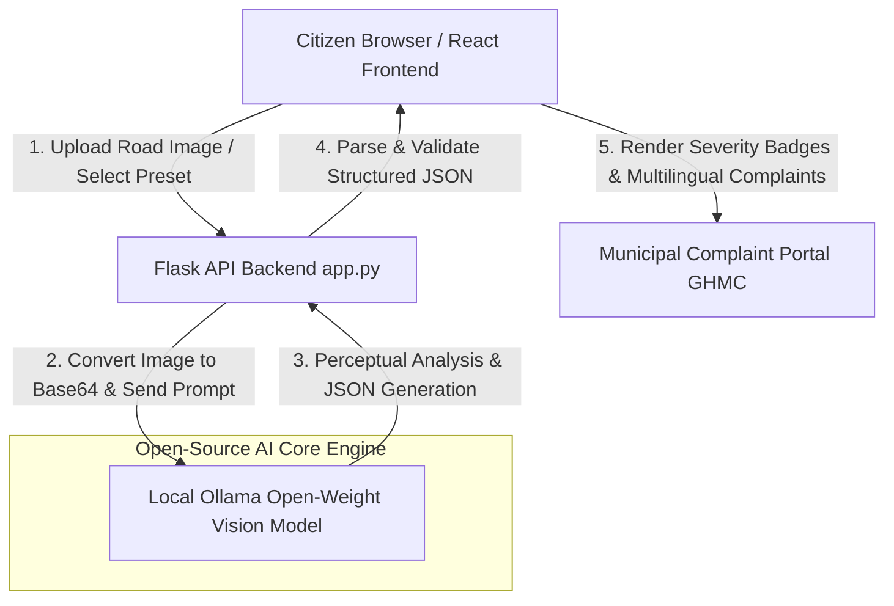

# 🛣️ RoadLens AI - Open-Source Civic Road Issue Reporter

[](LICENSE)
[]()
[-purple.svg)]()
[]()
[]()

> **RoadLens AI** is an open-source civic infrastructure inspection application powered by **local open-weight vision models (served via Ollama)** and **Python/Flask + React**. Citizens upload photos of road hazards (potholes, waterlogging, damaged signposts), and RoadLens extracts structured JSON hazard metrics and generates ready-to-submit municipal complaints in **English, Telugu (తెలుగు), and Hindi (हिंदी)**.

---

## 📸 Demo Preview & Features

- **Open-Weight Vision Perception**: Uses local vision models (Llava, Gemma3, Qwen2.5-VL, Llama 3.2 Vision) served via Ollama.
- **Structured Engineering JSON Output**: Extracts issue type, severity rating (Critical, High, Medium, Low), location hints, estimated dimensions, and recommended repair actions.
- **Multilingual Civic Complaint Generator**: Drafts formal municipal complaints for civic authorities (e.g., GHMC) in English, Telugu, and Hindi.
- **One-Click Sample Preset Inspector**: Includes pre-loaded real sample photos of potholes, street flooding, and fallen signs for instant hackday judging.
- **Resilient Multi-Tier Fallback Pipeline**: Automatically handles local Ollama startup delays, cloud API rate limits/503 errors, non-road images, and invalid file uploads with zero downtime.

---

## 🏗️ Architecture Diagram



### System Workflow
1. **Perception**: Citizen uploads an image of asphalt defects or road hazards.
2. **Local Vision Inference**: Flask calls the local Ollama API (`http://localhost:11434/api/generate`) running open-weight vision models (`llava`, `gemma3`, `qwen2.5-vl`).
3. **Structured JSON Extraction**: The model returns validated JSON matching our engineering schema.
4. **Interactive UI**: React renders visual severity indicators, hazard dimensions, confidence score meter, editable complaint letters, and raw JSON inspector.

---

## ⚡ Quickstart Guide

### Prerequisites
- Python 3.9+
- Node.js 18+
- [Ollama](https://ollama.com/) (for running local open-weight vision models)

### 1. Backend Setup (Flask)
```bash
# Clone repository
git clone https://github.com/shaikhadnan0123/roadlens-gemma.git
cd roadlens-gemma

# Install Python dependencies
pip install -r requirements.txt

# Start Flask API server
python app.py
# Backend runs on http://localhost:5000
```

### 2. Optional: Local Ollama Setup (Open-Weight AI)
```bash
# Pull an open-weight vision model
ollama pull llava

# Serve Ollama model locally
ollama serve
```

### 3. Frontend Setup (React + Vite)
```bash
cd frontend

# Install node packages
npm install

# Start Vite dev server
npm run dev
# Frontend opens on http://localhost:5173
```

---

## 🧪 Testing Sample Photos

RoadLens includes 3 pre-loaded real sample photos in `sample_images/` and `frontend/public/sample_images/`:
1. `pothole.jpg` — Deep asphalt hazard (Critical severity)
2. `waterlogging.jpg` — Urban street flooding (High severity)
3. `broken_sign.jpg` — Fallen regulatory speed sign post (Medium severity)

Simply click any sample thumbnail in the React UI to test instant vision inference!

---

## 📜 License

This project is open-source software licensed under the **[MIT License](LICENSE)**.

---

## 🤝 AI Assistant Disclosure & Acknowledgments

This project was built during the hackday using AI pair programming techniques for rapid prototyping, UI component styling, and test dataset generation. All open-weight vision perception and text generation run on local/open models.
